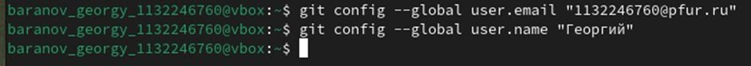
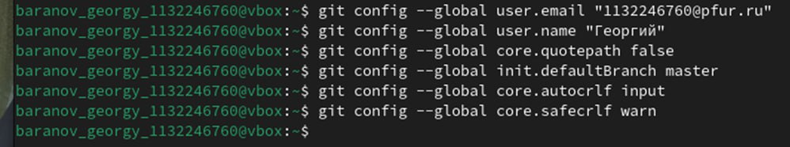
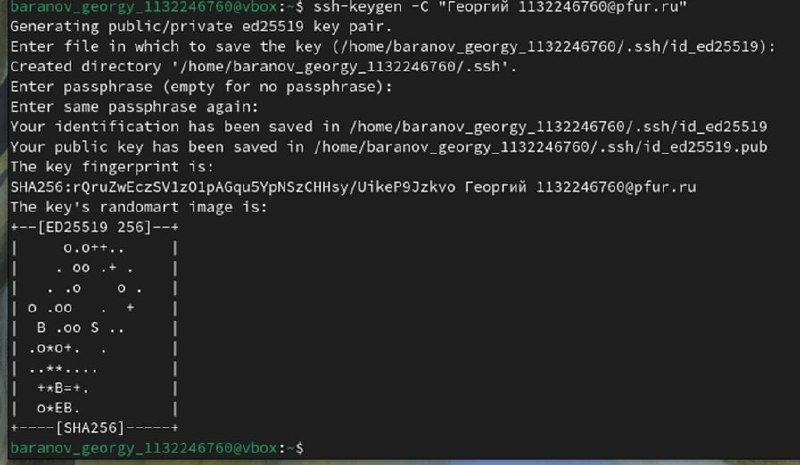
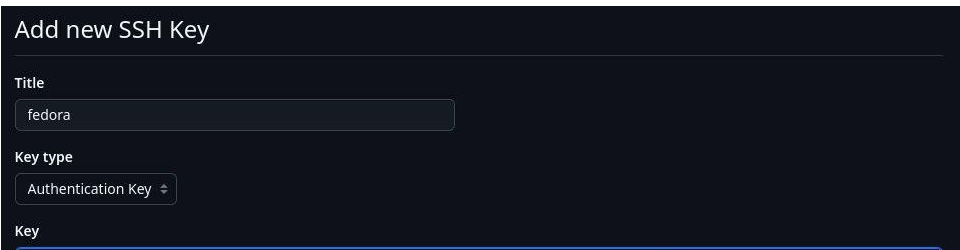
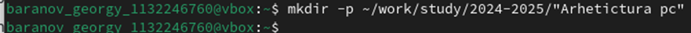
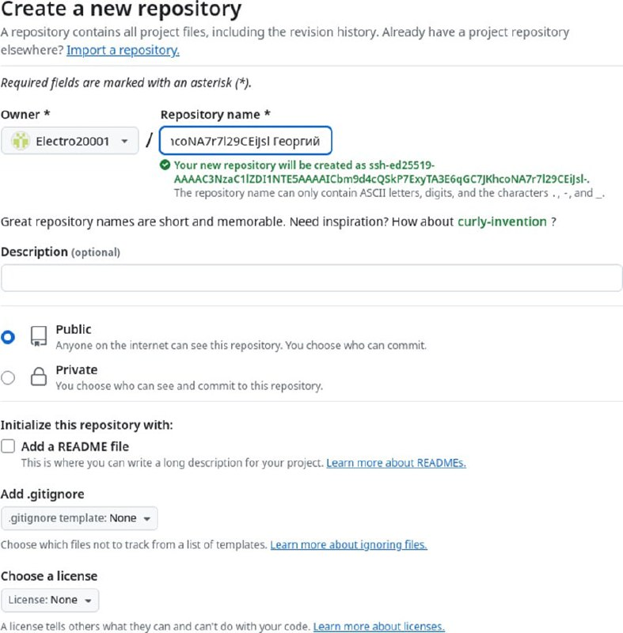
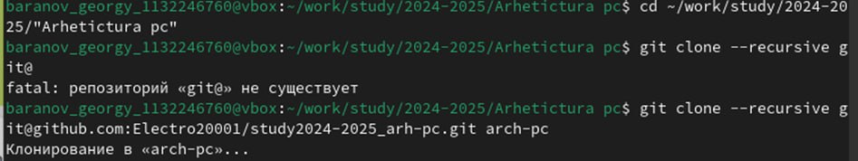
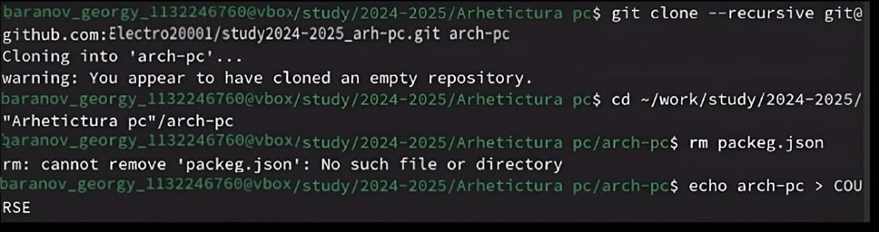
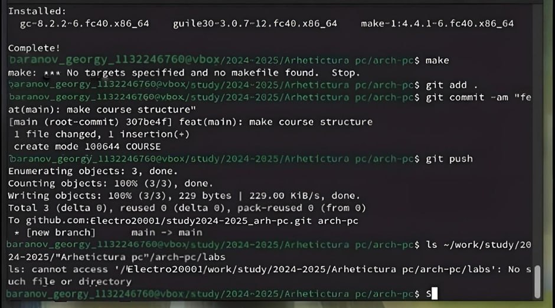

---
## Front matter
title: "Лабораторная работа №2"
subtitle: "Дисциплина: Архитектура компьютера"
author: "Баранов Георгий Павлович"

## Generic otions
lang: ru-RU
toc-title: "Содержание"

## Bibliography
bibliography: bib/cite.bib
csl: pandoc/csl/gost-r-7-0-5-2008-numeric.csl

## Pdf output format
toc: true # Table of contents
toc-depth: 2
lof: true # List of figures
lot: true # List of tables
fontsize: 12pt
linestretch: 1.5
papersize: a4
documentclass: scrreprt
## I18n polyglossia
polyglossia-lang:
  name: russian
  options:
	- spelling=modern
	- babelshorthands=true
polyglossia-otherlangs:
  name: english
## I18n babel
babel-lang: russian
babel-otherlangs: english
## Fonts
mainfont: IBM Plex Serif
romanfont: IBM Plex Serif
sansfont: IBM Plex Sans
monofont: IBM Plex Mono
mathfont: STIX Two Math
mainfontoptions: Ligatures=Common,Ligatures=TeX,Scale=0.94
romanfontoptions: Ligatures=Common,Ligatures=TeX,Scale=0.94
sansfontoptions: Ligatures=Common,Ligatures=TeX,Scale=MatchLowercase,Scale=0.94
monofontoptions: Scale=MatchLowercase,Scale=0.94,FakeStretch=0.9
mathfontoptions:
## Biblatex
biblatex: true
biblio-style: "gost-numeric"
biblatexoptions:
  - parentracker=true
  - backend=biber
  - hyperref=auto
  - language=auto
  - autolang=other*
  - citestyle=gost-numeric
## Pandoc-crossref LaTeX customization
figureTitle: "Рис."
tableTitle: "Таблица"
listingTitle: "Листинг"
lofTitle: "Список иллюстраций"
lotTitle: "Список таблиц"
lolTitle: "Листинги"
## Misc options
indent: true
header-includes:
  - \usepackage{indentfirst}
  - \usepackage{float} # keep figures where there are in the text
  - \floatplacement{figure}{H} # keep figures where there are in the text
---

# Цель работы

Целью работы является изучить идеологию и применение системы контроля
версий. Приобрести практические навыки по работе с системой git.

# Задание

На основе методических указаний провести работу с базовыми командами
системы контроля версий git, выучить применение команд для разных случаев
использования, настроить GitHub.

# Теоретическое введение

Системы контроля версий (Version Control System, VCS) применяются при
работе нескольких человек над одним проектом. Обычно основное дерево проекта
хранится в локальном или удалённом репозитории, к которому настроен доступ для
участников проекта. При внесении изменений в содержание проекта система контроля
версий позволяет их фиксировать, совмещать изменения, произведённые разными
участниками проекта, производить откат к любой более ранней версии проекта, если
это
требуется.
В
классических
системах
контроля
версий
используется
централизованная модель, предполагающая наличие единого репозитория для
хранения файлов. Выполнение большинства функций по управлению версиями
осуществляется специальным сервером. Участник проекта (пользователь) перед
началом работы посредством определённых команд получает нужную ему версию
файлов. После внесения изменений, пользователь размещает новую версию в
хранилище. При этом предыдущие версии не удаляются из центрального хранилища и
к ним можно вернуться в любой момент. Сервер может сохранять не полную версию
изменённых файлов, а производить так называемую дельта-компрессию — сохранять
только изменения между последовательными версиями, что позволяет уменьшить
объём хранимых данных. Системы контроля версий поддерживают возможность
отслеживания и разрешения конфликтов, которые могут возникнуть при работе
нескольких человек над одним файлом. Можно объединить (слить) изменения,
сделанные разными участниками (автоматически или вручную), вручную выбрать
нужную версию, отменить изменения вовсе или заблокировать файлы для изменения.
В зависимости от настроек блокировка не позволяет другим пользователям получить
рабочую копию или препятствует изменению рабочей копии файла средствами
файловой системы ОС, обеспечивая таким образом, привилегированный доступ
только одному пользователю, работающему с файлом.

# Выполнение лабораторной работы

## Техническое обеспечение

Лабораторная работа была выполнена на домашнем компьютере под
управлением операционной системы Fedora Workstation 40.

## Базовая настройка Git

Для начала я проведу предварительную конфигурацию Git, для этого открываю
терминал и ввожу команды на (рис. -@fig:001).

{#fig:001 width=70%}

Далее настраиваю параметры utf-8, имя начальной ветки, autocrlf и safecrlf. (рис. -@fig:002)

{#fig:002 width=70%}

Далее создаю пару ssh ключей для интеграции с платформой GitHub. (рис. -@fig:003)

{#fig:003 width=70%}

Далее я перехожу на сайт GitHub, авторизуюсь, перехожу в настройки аккаунта,
вставляю публичный ключ в предназначенном для этого поле. (рис. -@fig:004)

{#fig:004 width=70%}

## Создание рабочего пространства и репозитория курса на основе шаблона

Рабочее пространство при выполнении лабораторных работ должно придерживаться определённой структурной иерархии, для этого я создаю директорию на своем рабочем компьютере. (рис. -@fig:005) 

{#fig:005 width=70%}

## Создание репозитория курса на основе шаблона

Создаю репозиторий на основе имеющего шаблона (рис. -@fig:006) через
функционал клонирования интерфейса GitHub.

{#fig:006 width=70%}

Перехожу в каталог и клонирую репозиторий. (рис. -@fig:007)

{#fig:007 width=70%}

Создание необходимых каталогов курса (рис. -@fig:008)

{#fig:008 width=70%}

## Задания для самостоятельный работы

Через терминал отправляю предыдущий отчет по лабораторной работе на свой
удаленный репозиторий в GitHub 

Отслеживание файлов, их отправление в репозиторий и проверка выполнения кода (рис. -@fig:009)

{#fig:009 width=70%}

# Выводы

Мы познакомились с системой контроля git, выучили команды для работы с ним, создали свой репозиторий на платформе github, где в последующем будут храниться все будущие отчеты по лабораторным работам.

# Список литературы{.unnumbered}

1. [Лабораторная работа](https://esystem.rudn.ru/pluginfile.php/2089082/mod_resource/content/0/%D0%9B%
D0%B0%D0%B1%D0%BE%D1%80%D0%B0%D1%82%D0%BE%D1%80%D0%
BD%D0%B0%D1%8F%20%D1%80%D0%B0%D0%B1%D0%BE%D1%82%D0%
B0%20%E2%84%962.%20%D0%A1%D0%B8%D1%81%D1%82%D0%B5%D0%
BC%D0%B0%20%D0%BA%D0%BE%D0%BD%D1%82%D1%80%D0%BE%D0
%BB%D1%8F%20%D0%B2%D0%B5%D1%80%D1%81%D0%B8%D0%B9%20
Git.pdf)
2. [Курс на ТУИС](https://esystem.rudn.ru/mod/page/view.php?id=1030492)
3. [Методические указания](https://esystem.rudn.ru/mod/resource/view.php?id=1030495)
